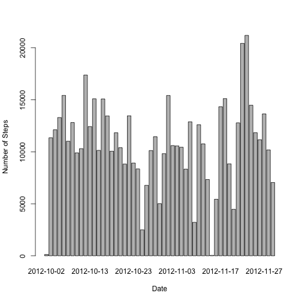
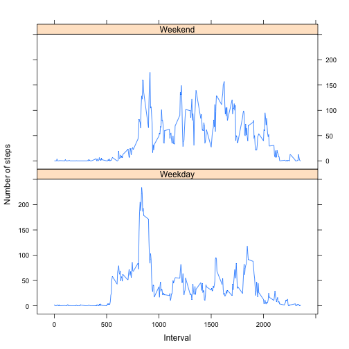

Reproducible Research: Peer Assessment 1
========================================

Load the data (note that the data is already archived in the repository).


```r
unzip("activity.zip")
activityDF <- read.csv( "activity.csv",
	sep=",",
	header=TRUE,
	na.strings="NA",
	colClasses=c("numeric", "character", "numeric")
	)
```

We ignore (filter out) the missing values (NAs) in the dataset for the first part.


```r
completeDF <- activityDF[!is.na(activityDF$steps),]
```

Summarize complete (without NAs) activity data.


```r
summary(completeDF)
```

```
##      steps           date              interval   
##  Min.   :  0.0   Length:15264       Min.   :   0  
##  1st Qu.:  0.0   Class :character   1st Qu.: 589  
##  Median :  0.0   Mode  :character   Median :1178  
##  Mean   : 37.4                      Mean   :1178  
##  3rd Qu.: 12.0                      3rd Qu.:1766  
##  Max.   :806.0                      Max.   :2355
```

Now we examine the mean total number of steps taken per day.

A Histogram of the total number of steps taken each day,


```r
stepsByDate <- aggregate(steps ~ date, data = completeDF, FUN=sum)
barplot(stepsByDate$steps, names.arg=stepsByDate$date, xlab = "Date", ylab = "Number of Steps")
```

 

Mean total number of steps taken per day,


```r
mean(stepsByDate$steps)
```

```
## [1] 10766
```

Median total number of steps taken per day,


```r
median(stepsByDate$steps) 
```

```
## [1] 10765
```

Now let's look at the average daily activity pattern

Time series plot (i.e. type = "l") of the 5-minute interval (x-axis) and the average number of steps taken, averaged across all days (y-axis)


```r
stepsByInterval <- aggregate(steps ~ interval, data=completeDF, FUN=mean)
plot(stepsByInterval, type="l")
```

 

Which 5-minute interval, on average across all the days in the dataset, contains the maximum number of steps?


```r
stepsByInterval$interval[which.max(stepsByInterval$steps)]
```

```
## [1] 835
```


## Imputing missing values

Note that there are a number of days/intervals where there are missing values (coded as NA). The presence of missing days may introduce bias into some calculations or summaries of the data.

Calculate and report the total number of missing values in the dataset (i.e. the total number of rows with NAs)

Total number of missing values in the data set is the number of measured steps minus the number of complete rows,


```r
length(activityDF$steps) - length(completeDF$steps)
```

```
## [1] 2304
```

Devise a strategy for filling in all of the missing values in the dataset. The strategy does not need to be sophisticated. For example, you could use the mean/median for that day, or the mean for that 5-minute interval, etc.
Create a new dataset that is equal to the original dataset but with the missing data filled in.


```r
stepsByDate <- aggregate(steps ~ date, data = activityDF, FUN=sum)
filledDF <- merge(activityDF, stepsByDate, by="date", suffixes=c("",".new"))
naSteps <- is.na(filledDF$steps)
filledDF$steps[naSteps] <- filledDF$steps.new[naSteps]
filledDF <- filledDF[,1:3]
```

Make a histogram of the total number of steps taken each day and Calculate and report the mean and median total number of steps taken per day. 


```r
stepsByDate <- aggregate(steps ~ date, data=filledDF, FUN=sum)
barplot(stepsByDate$steps, names.arg=stepsByDate$date, xlab="Date", ylab="Number of Steps")
```

 

Mean for the missing data filled in.


```r
mean(stepsByDate$steps)
```

```
## [1] 10766
```

Median for missing data filled in.


```r
median(stepsByDate$steps)
```

```
## [1] 10765
```
*Do these values differ from the estimates from the first part of the assignment?*

No, they do not.

*What is the impact of imputing missing data on the estimates of the total daily number of steps?*

Little to no impact.

## Are there differences in activity patterns between weekdays and weekends?

For this part the weekdays() function may be of some help here. Use the dataset with the filled-in missing values for this part.

Create a new factor variable in the dataset with two levels – “weekday” and “weekend” indicating whether a given date is a weekday or weekend day.


```r
WeekPart <- function(date) {
	if(weekdays(as.Date(date)) %in% c("Saturday", "Sunday")) {
		day <- "Weekend"
	} else {
		day <- "Weekday"
	}
}
filledDF$weekPart <- as.factor(sapply(filledDF$date, WeekPart))
```

Make a panel plot containing a time series plot (i.e. type = "l") of the 5-minute interval (x-axis) and the average number of steps taken, averaged across all weekday days or weekend days (y-axis).


```r
library(reshape2)

melted <- melt(filledDF, measure.vars="steps")

meanSteps <- dcast(melted, weekPart+interval~variable, mean)

library(lattice)

xyplot(steps~interval|weekPart,
	data=meanSteps,
	xlab="Interval",
	ylab="Number of steps",
	type="l",
	layout=c(1,2)
)
```

 
